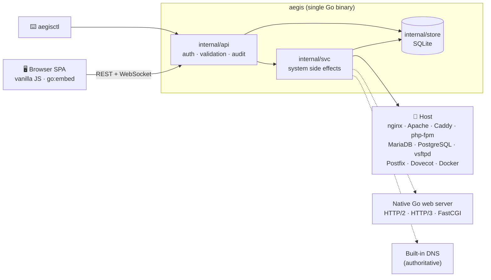

<div align="center">

# 🛡️ Aegis

### A self-hosted Linux web hosting control panel — one Go binary, zero build step.

Provision websites, DNS, SSL, mail, databases, FTP, containers and backups from a
fast dark "ops console" in your browser — or script all of it with `aegisctl`.

[](https://go.dev)
[](https://www.sqlite.org)
[](https://www.php.net)
[](LICENSE)
[](docs/ROADMAP.md)

[**Quick start**](#-quick-start) ·
[**Features**](#-features) ·
[**Security**](#-security-model) ·
[**CLI**](#-aegisctl) ·
[**Architecture**](#-architecture) ·
[**Roadmap**](docs/ROADMAP.md)

</div>

---

## ✨ Why Aegis?

|  |  |
|---|---|
| 📦 **One binary** | API, embedded frontend, DNS server and an optional customer web server all ship as a single Go executable. |
| 🔌 **Bring your own stack** | nginx, Apache, Caddy — or Aegis' own **native Go web server** with HTTP/2, HTTP/3 and a built-in FastCGI client. |
| 🧱 **Real isolation** | Every customer gets a private system group, chrooted file access that runs *as the account*, and per-site PHP-FPM pools. |
| 🪶 **No frontend toolchain** | A vanilla-JS SPA embedded with `go:embed`. No npm, no bundler, no framework. |
| 🖥️ **UI or CLI** | Everything in the browser is also reachable through the REST API and `aegisctl`. |
| 🐧 **Any Linux** | Bare metal or VM. apt / dnf / yum / pacman / zypper / apk aware. Docker is *development only*. |

---

## 🚀 Quick start

### Bare metal

One command installs the whole stack from distro packages — PHP-FPM 7.4 → 8.4,
MariaDB + PostgreSQL (admin credentials seeded), a web server, vsftpd, the mail
stack, fail2ban, ffmpeg / poppler / composer — then builds the panel and installs
a systemd service:

```bash
git clone https://github.com/eoghan2t9/Aegis-Hosting-Control-Panel.git hosting && cd hosting
sudo scripts/install-stack.sh                  # everything
sudo scripts/install-stack.sh --no-mail        # tailor it:  --no-ftp  --no-db  --no-tools
                                               #             --no-fail2ban  --with-docker
                                               #             --php-versions 8.2,8.3
                                               #             --with-caddy  /  --with-apache
```

When the installer finishes the panel is **already running** at
`http://<server-ip>/aegis` and the admin password is printed **once** at the end
of the output:

```bash
open http://<server-ip>/aegis       # any hostname on the server works: http://<domain>/aegis
aegisctl user reset-pass -p '<new-password>' admin      # lost it? reset it
```

<details>
<summary><b>🔐 How installer credentials are handled</b></summary>

<br>

- The installer generates the secret key and an admin password, starts the panel,
  verifies the login works, then wipes the one-time credentials from `/run`.
- Credentials never live in the systemd unit (any local user can read unit
  properties via `systemctl show`): DB admin passwords are in the root-only
  `/etc/aegis/aegis.env`, and the first-boot admin env file is deleted after
  bootstrap.
- Prefer your own credentials? Pass `AEGIS_ADMIN_USER` / `AEGIS_ADMIN_PASSWORD`
  to the installer. Re-running the installer never resets an existing admin.
- The `/aegis` prefix is proxied through every generated vhost (nginx, Apache,
  Caddy) and the native Go web server, so the panel stays reachable on any
  hostname — including the bare server IP before you host a single site.

</details>

### Development (Docker)

```bash
make docker-up          # builds the dev container (first run takes a while)
open http://localhost:8080/aegis
# login: admin / admin   (from AEGIS_ADMIN_PASSWORD in docker/docker-compose.yml)
```

The dev container serves the panel at the same `/aegis` prefix used in
production (`AEGIS_PANEL_BASE`). The repo is bind-mounted, so **edits never need
an image rebuild**:

| You changed… | Do this |
|---|---|
| Go code | `docker compose -f docker/docker-compose.yml restart aegis` |
| Frontend (`web/`) | refresh the browser (`AEGIS_DEV_WEB=/app/web`) |
| `docker/Dockerfile.dev` | rebuild the image |

```bash
make build              # bin/aegis + bin/aegisctl
make test && make vet   # go test ./... && go vet ./...
```

> [!NOTE]
> Docker is used **only** for development. A bare-metal install — and the
> installer script — never depend on it. (The *Containers* feature shells out to
> the Docker CLI for **customers'** containers; that is a separate, opt-in thing.)

---

## 🧩 Features

### 🌐 Websites & web servers

- **Domain management** — one document root per domain, quota-checked, vhosts
  regenerated on every change. Aliases, per-domain IP from an **IP pool**.
- **Under-construction placeholder** for new domains, styled like the panel — and
  a **preview through the panel** (👁 in *Domains*) so you can see a site, PHP
  included, before DNS has propagated.
- **Four web-server backends** — nginx, Apache, Caddy, or the **native Go web
  server**. Switch from the panel; every backend also proxies `/aegis`.
- **Native Go web server** — SNI certificates, an in-tree FastCGI client for
  PHP, an **`.htaccess` interpreter** (rewrites, redirects, `Require`/`Deny`,
  `<Files>`, `ErrorDocument`, `Header`, …), and **HTTP/3 (QUIC)** with `Alt-Svc`.
- **Performance options per site** *(native server)* — gzip compression, static
  asset `Cache-Control`, and an in-memory **page cache** for anonymous PHP pages
  that never serves personalised responses.
- **Multi-PHP 7.4 → latest** — every installed php-fpm is detected, and each
  website gets its **own isolated pool** and socket. Per-site `php.ini`
  overrides (`memory_limit`, `upload_max_filesize`, OPcache options, …), and a
  per-version support status (*supported / ending / end-of-life*).
- **Reverse proxy** — attach a container (or any local port) to a domain and its
  vhost proxies to it instead of serving PHP, on all four backends.
- **Web-app installer** — one-click, manifest-driven installs of **WordPress ·
  Laravel · Drupal · Grav · Craft CMS · Flarum · phpBB · MediaWiki · PrestaShop ·
  Nextcloud · Matomo · phpMyAdmin**.
- **Access & error logs** viewer per site.

### 🔒 DNS & SSL

- **Authoritative DNS server** built in (miekg/dns), with RFC 1035 zone files.
- Records: **A · AAAA · CNAME · MX · TXT · NS · SRV · CAA**.
- **Provider plugins** — sync zones to **Cloudflare** (add more in
  `internal/svc/dns.go`); provider tokens are encrypted at rest.
- **Let's Encrypt** via lego — HTTP-01 (webroot) or DNS-01 (Cloudflare), a
  self-signed fallback, and **automatic renewal**.

### 📧 Email

- **Virtual mail hosting** on Postfix + Dovecot, backed directly by the panel's
  store — mail domains, mailboxes and aliases.
- **DKIM (OpenDKIM), SPF and DMARC** generated and published into the domain's
  DNS zone when you enable mail.
- Built-in **webmail** with its own session.

### 🗄️ Databases

- **MariaDB and PostgreSQL** provisioning — database + user + grants in one step.
- **Built-in database editor** (phpMyAdmin-style, native Go, both engines):
  browse and edit rows, schema and index management, objects, search,
  maintenance, and a **streamed import/export** that handles very large dumps.
  It connects as the database's *own* user, never as admin.
- Dumps and restores; passwords are **encrypted at rest** and only revealed by an
  audited credentials endpoint.

### 📁 Files & FTP

- **File manager** — list, edit, create, rename, delete, chmod, chown, search,
  zip / unzip, drag-and-drop upload and image/PDF/video **thumbnails**. Strictly
  chrooted to the account home.
- **FTP** — vsftpd with chrooted logins; a primary account per user plus extra
  sub-accounts. **TLS-only** by default.
- **WebFTP** — a browser file manager on `webftp.<domain>` with single sign-on
  from the panel.

### 🐳 Containers

- Run **Docker containers under a customer account** through the real `docker`
  CLI — argv-only, with ports / env / volumes as **structured input** (no
  free-form flags, so no path to `--privileged` or a socket mount).
- Ports bind to `127.0.0.1` by default; publishing publicly is an explicit
  per-port opt-in.
- Off by default per hosting package (`allow_docker`); Docker Engine installs on
  demand from the *Containers* page (or `--with-docker` at install time).

### 👥 Accounts, packages & resellers

- **Roles** — admin, reseller and user; resellers manage only the accounts they
  created.
- **Hosting packages** — quotas and feature flags that switch whole areas of the
  UI on or off per plan.
- **Quotas** — application-level disk and bandwidth accounting that **suspends**
  an account over its hard limit.
- **Suspend / unsuspend** across *every* service (web, FTP, mail, cron, …) with a
  branded suspended page, restoring exactly what was changed. **Purge** removes a
  user and everything they own.
- **Login as user** — admins impersonate accounts; the UI shows a persistent
  banner and the audit log records both identities.

### 💾 Backups

- **Full or per-account** `tar.gz` archives: home directories, database dumps,
  FTP logins, domains and DNS records, plus a JSON manifest (secrets are redacted).
- **Scheduled backups** with **remote targets** — **S3, Backblaze B2 and SFTP** —
  and per-target retention.
- One-click **restore** that recreates accounts.

### ⏱️ Automation & integrations

- **Cron jobs** per user, run as the account.
- **Scoped, expiring API tokens** (`aegis_…`) for scripting.
- A complete **REST + WebSocket API**; the UI has no private endpoints.

### 📊 Monitoring & server management

- **Live dashboard** — CPU / memory / swap / network over WebSocket, per-user
  usage, service states, and an in-memory metrics history.
- **Web terminal** (PTY over WebSocket) that drops privileges to the account.
- **Process viewer** with real per-user CPU/memory accounting from `/proc`.
- **System updates** — search, install and update OS packages through apt, dnf,
  yum, pacman, zypper or apk.
- **Auto-tuning** on first boot — sizes php-fpm, the web server and kernel
  parameters for the host (`/etc/aegis/tuned/`).
- **Audit log** of every admin and security-relevant action.

### 🛡️ Security centre

- **fail2ban** integration — see banned IPs and lift bans from the panel.
- **Login throttling** per user + address, per user and per address.
- **TOTP two-factor login** with one-time backup codes.

---

## 🔐 Security model

The panel runs as root; customers must never be able to reach that. Aegis is
built around a few hard rules:

| Rule | How it's enforced |
|---|---|
| **Customers never get root I/O** | File operations run through `runAsAccount`, which switches the thread's fsuid / fsgid / groups to the account. Symlink tricks in a customer's home can't redirect a root read. |
| **One private group per account** | Accounts are created only through `ProvisionAccount`; the web server reads a site through an **ACL**, not a shared group. |
| **No tools on untrusted content as root** | ffmpeg, pdftoppm, tar and friends run in an account sandbox; output is copied out only after it's verified to be a regular file. |
| **Authorization on every object** | Handlers check ownership; not-yours returns **404**, so existence isn't leaked. |
| **Secrets at rest** | Database passwords and provider tokens are AES-256-GCM encrypted; the SQLite file is forced to `0600`; list APIs and backup manifests never contain secrets. |
| **Immediate revocation** | JWTs are re-checked against a session row on every request, so logout, password reset and suspension take effect at once. |
| **Everything is audited** | Every mutation writes an audit entry — without secrets in it. |
| **Safe by construction** | Argv-only `exec` (never `sh -c` with user input), allow-lists for SQL types, validated usernames / domains / DB names, no setuid bits or symlinks from archives. |
| **Hardened services** | FTP is TLS-only; login reuse guards stop a customer from claiming a system or another customer's account. |

---

## ⌨️ aegisctl

The CLI talks to the same code as the UI.

```bash
aegisctl setup                                   # init config, dirs, database, auto-tune
aegisctl status                                  # host and service overview
aegisctl user create -u alice --role user        # users: create / list / delete
aegisctl user reset-pass -p 'new-pass' alice     # also revokes sessions
aegisctl user suspend alice                      # or: unsuspend
aegisctl package create -n starter --domains 5 --databases 5
aegisctl domain add alice example.com --php 8.3
aegisctl dns sync example.com                    # push the zone to its provider
aegisctl ssl issue example.com --challenge dns   # Let's Encrypt (http or dns)
aegisctl ftp add alice deploy                    # FTP logins
aegisctl db create alice mariadb blog            # or: postgres
aegisctl backup …                                # create / list / restore
aegisctl tune --apply                            # regenerate + apply host tuning
aegisctl isolate --dry-run                       # migrate accounts to private groups
```

Run `aegisctl help` for the full command list.

---

## 🏗️ Architecture



The layering rule is strict: **`api` never shells out, `svc` never sees an HTTP
request, `store` never touches the host.** Migrations are additive-only.
Design goals, the request lifecycle and the data model are in
[`docs/ARCHITECTURE.md`](docs/ARCHITECTURE.md).

<details>
<summary><b>📂 Repository layout</b></summary>

```
cmd/aegis        panel server (API + embedded frontend + native Go site server)
cmd/aegisctl     CLI
internal/config  configuration (JSON + env overrides, secret key)
internal/store   SQLite data layer (users, domains, dns, ssl, mail, dbs, audit…)
internal/auth    JWT auth, roles, sessions, impersonation, TOTP
internal/svc     services: domains, php, webserver (+fastcgi, +htaccess, +http3),
                 dns (+dnsserver, +cloudflare), ssl (lego), ftp, webftp, databases,
                 dbeditor, files, mail, backups, cron, docker, webapps, quota,
                 suspend, security, system, tuning, terminal
internal/api     REST API + WebSocket handlers
web/             frontend (embedded via go:embed; disk-served in dev)
scripts/         bare-metal installer (install-stack.sh)
docker/          dev container (full stack, bind-mounted) — development only
docs/            architecture and roadmap
```

</details>

---

## 🧪 Development notes

- `go build ./... && go vet ./... && go test ./...` is the gate. Tests need
  neither root nor system services; database-engine tests are opt-in through
  `AEGIS_IT_MYSQL_DSN` / `AEGIS_IT_PG_DSN`.
- The frontend has no build step — edit `web/`, and with `AEGIS_DEV_WEB` set it is
  served straight from disk.
- Add a page by writing a view in `web/js/views/` and registering it in
  `web/js/app.js`; add an endpoint in `internal/api/server.go` with the
  auth / role / feature guards and an ownership check.

## 🗺️ Roadmap

Still ahead: WebAuthn / passkeys, kernel-level (XFS) quotas, a Node / PM2 app
manager, resource-usage history and billing reports, DNSSEC, white-label
theming, notifications and multi-server mode. See
[`docs/ROADMAP.md`](docs/ROADMAP.md).

## 📄 License

MIT — see [`LICENSE`](LICENSE).

<div align="center">
<sub>Built with Go · Ships as one binary · Treat as pre-1.0</sub>
</div>
